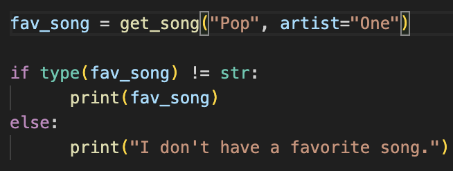
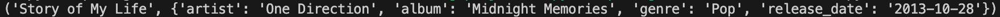
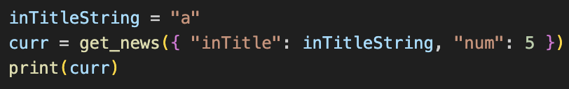
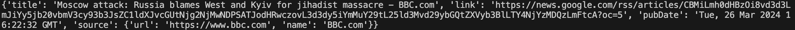
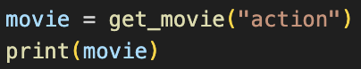
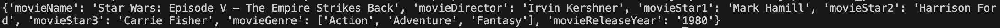
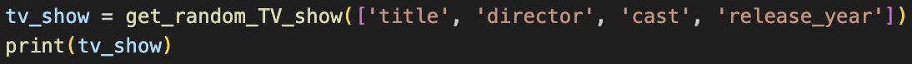
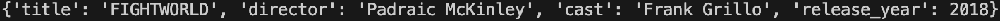

# PyMedia

## Concept
We wanted to create a package that allows users to generate different kinds of media. We figured this kind of package could potentially be used to easily populate datasets or to generate lists of certain types of media that are popular right now (assuming we keep our datasets updated). The package comes with four functions that allow users to return different songs, movies, TV shows, and current events. 

## Installation

1). Make a pipenv virtual environment and install the latest version of the package using: pipenv install -i https://test.pypi.org/simple/ pyrandommedia.

2). Start the virtual environment with the command: pipenv shell.

3). Create a Python program file that imports the functions and uses it.
Example:
`from pyrandommedia import get_news`
`from pyrandommedia import get_random_TV_show`
`from pyrandommedia import get_song`
`from pyrandommedia import get_movie`

4). Run the program using: python3 -m sample_program.py. Run the python command in the virtual environment.

5). Use the command exit to end the virtual environment.

[Link to sample file](https://github.com/software-students-spring2024/3-python-package-exercise-team-kiwi/blob/main/sample_program.py)

## Usage
Once installed and imported, you can call each function to generate a certain kind of media.

### get_song()
You can call the get_song() function to generate a song in a specific genre, with optional specifications for the artist/band names, song title, and release date. All inputs must be strings. 

The variable fav_song will now contain a tuple holding a song in the Pop genre by an artist/band with the word "One" in it. An example tuple would look like this: 

Additionally, if no song meeting the arguments' criteria is found, get_song() will return a string. 

### get_news()

You can call the get_news() function to generate a list of current events. The function takes a dictionary as an argument that optionally allows the user to only return a certain number of events as well as news title with a certain string in them. 

The variable curr will now contain a list of 5 current news stories whose titles have the string "a" in them. Each news story is represented as a dictionary:

### get_movie()

You can call the get_movie() function to generate a movie in a specific genre. 

The variable movie will now contain a dictionary holding a movie in the action genre. An example of dictionary would look like this:

### get_random_TV_show()

You can call the get_random_TV_show() function to generate a TV show.

The variable tv will now contain a dictionary holding a TV show and its details. An example of dictionary would look like this:

## Function Documentation
Sang
Include link to example program here too

## How to contribute (Virtual environment, install dependencies, and build and test your package)

1). First you will need to set up the python virtual environment. This project uses pipenv. If you do not have it install you will need to do so with the command `python install pipenv`

2). To set up the virtual environment, in the root directory run the command `pipenv shell`, then run `pipenv install`. This will install all of the needed dependences.

3). You can run the package in the __main__.py file in the root directory. You will first need to add your functions into the pyMediaFunction.py file and inport them into the __main__.py file. 

4). To test the functions you will need to first add tests into the test_pyRandomMedia.py file. Then you can run the tests with the command `python3 -m pytest`. This will tell you how many tests pass or fail. 

5). To build the python package you can use the command `python -m build`

6). After you have added your functions and tested them, you can make a pull request from a branch of the repo with the commands `git add .`, then `git commit -m {your message}`, and to pull you use `git push origin main`. 

## Team members

Stanley Moukhametzianov (SM9231) [Github Profile](https://github.com/Stanley-Moukhametzianov)
 
Benson Li (BL2995) [Github Profile](https://github.com/bensonnli)
 
Nicholas Meng (ndm9914) [Github Profile](https://github.com/Nmeng01)
 
Sangeyl Lee (SL6733) [Github Profile](https://github.com/S2ang) 

Here's the link to our package on PyPI:

[Link](https://test.pypi.org/project/pyrandommedia/)

